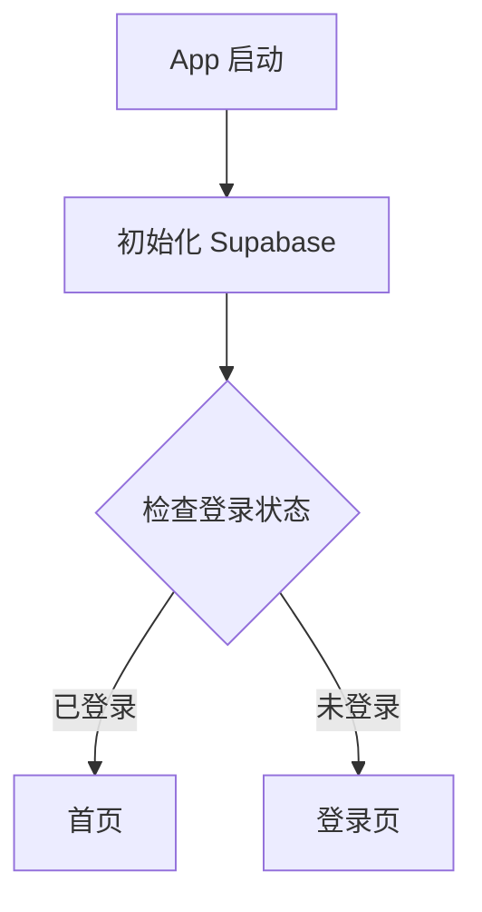
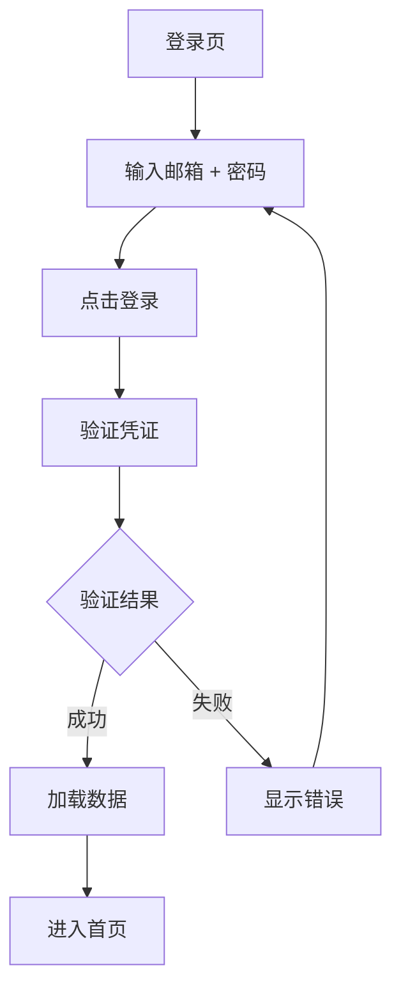
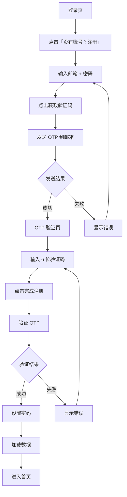
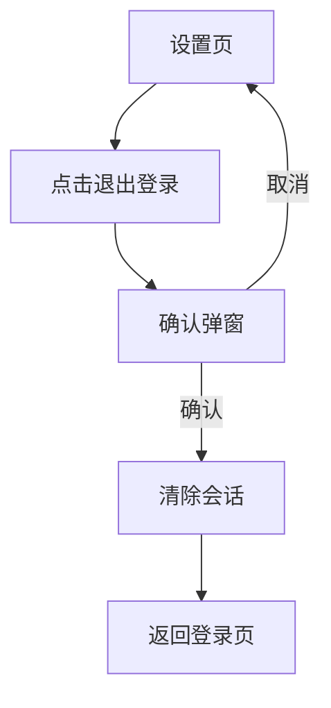
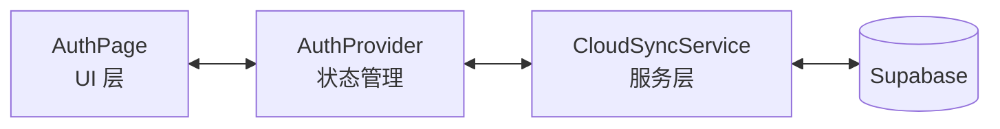

# 用户认证

## 功能概述

用户认证是 Easy 应用的基础功能，确保用户数据的安全存储和跨设备同步。所有健康记录都与用户账号绑定，存储在云端。

### 核心需求

| 需求 | 说明 |
|-----|------|
| 账号体系 | 每个用户拥有独立账号，数据隔离 |
| 云端存储 | 记录存储在 Supabase，支持多设备同步 |
| 强制登录 | 必须登录后才能使用应用 |
| 多用户基础 | 为后续「多用户分享」功能提供账号基础 |

---

## 认证方式

### 登录

| 方式 | 说明 | 状态 |
|-----|------|------|
| 邮箱 + 密码 | 已注册用户使用邮箱和密码登录 | ✅ 已实现 |

### 注册

| 方式 | 说明 | 状态 |
|-----|------|------|
| 邮箱 OTP 验证 | 输入邮箱后发送验证码，验证后设置密码 | ✅ 已实现 |

---

## 用户流程

### 启动流程

### 登录流程

**登录表单验证**：
- 邮箱：必填，格式验证
- 密码：必填，至少 6 位

### 注册流程

**注册表单验证**：
- 邮箱：必填，格式验证
- 密码：必填，至少 6 位
- 验证码：6 位数字

### 退出流程

---

## 界面设计

### 登录/注册页

| 元素 | 说明 |
|-----|------|
| 标题 | 「欢迎使用 Easy」（首次）/ 「登录」/「注册」|
| 邮箱输入框 | 带邮箱图标，键盘类型 email |
| 密码输入框 | 带锁图标，可切换显示/隐藏 |
| 主按钮 | 「登录」或「获取验证码」|
| 切换链接 | 「没有账号？注册」/「已有账号？登录」|
| 错误提示 | 红色背景卡片，显示错误信息 |

### OTP 验证页

| 元素 | 说明 |
|-----|------|
| 标题 | 「验证邮箱」|
| 提示 | 「验证码已发送到 xxx@xxx.com」|
| 验证码输入 | 6 位数字，大字体，居中 |
| 主按钮 | 「完成注册」|
| 返回链接 | 「使用其他邮箱」|

---

## 技术实现

### 架构

### 涉及文件

| 文件 | 职责 |
|-----|------|
| `lib/main.dart` | 应用入口，AuthGate 组件 |
| `lib/feature/auth/auth_page.dart` | 登录/注册页面 UI |
| `lib/provider/auth_provider.dart` | 认证状态管理 |
| `lib/service/cloud_sync_service.dart` | Supabase 交互封装 |
| `lib/core/config/supabase_config.dart` | Supabase 配置 |

### 状态管理

**AuthProvider 状态**：

| 状态 | 类型 | 说明 |
|-----|------|------|
| `isLoading` | bool | 是否正在执行认证操作 |
| `error` | String? | 最后一次错误信息 |
| `isLoggedIn` | bool | 是否已登录 |
| `isWaitingForOtp` | bool | 是否在等待 OTP 输入 |
| `pendingEmail` | String? | 待验证的邮箱（注册流程中）|
| `userId` | String? | 当前登录用户 ID |
| `userEmail` | String? | 当前登录用户邮箱 |

### Supabase API 调用

| 操作 | API |
|-----|-----|
| 密码登录 | `auth.signInWithPassword()` |
| 发送 OTP | `auth.signInWithOtp(shouldCreateUser: true)` |
| 验证 OTP | `auth.verifyOTP()` |
| 设置密码 | `auth.updateUser()` |
| 退出登录 | `auth.signOut()` |

---

## 安全考虑

| 项目 | 当前实现 |
|-----|---------|
| 密码长度 | 最少 6 位 |
| OTP 有效期 | Supabase 默认（通常 1 小时）|
| 会话管理 | Supabase 自动处理 Token 刷新 |
| 数据隔离 | RLS 策略确保用户只能访问自己的数据 |

---

## 待改进项

| 改进项 | 说明 | 优先级 |
|-------|------|-------|
| 忘记密码 | 支持密码重置功能 | P3 |

