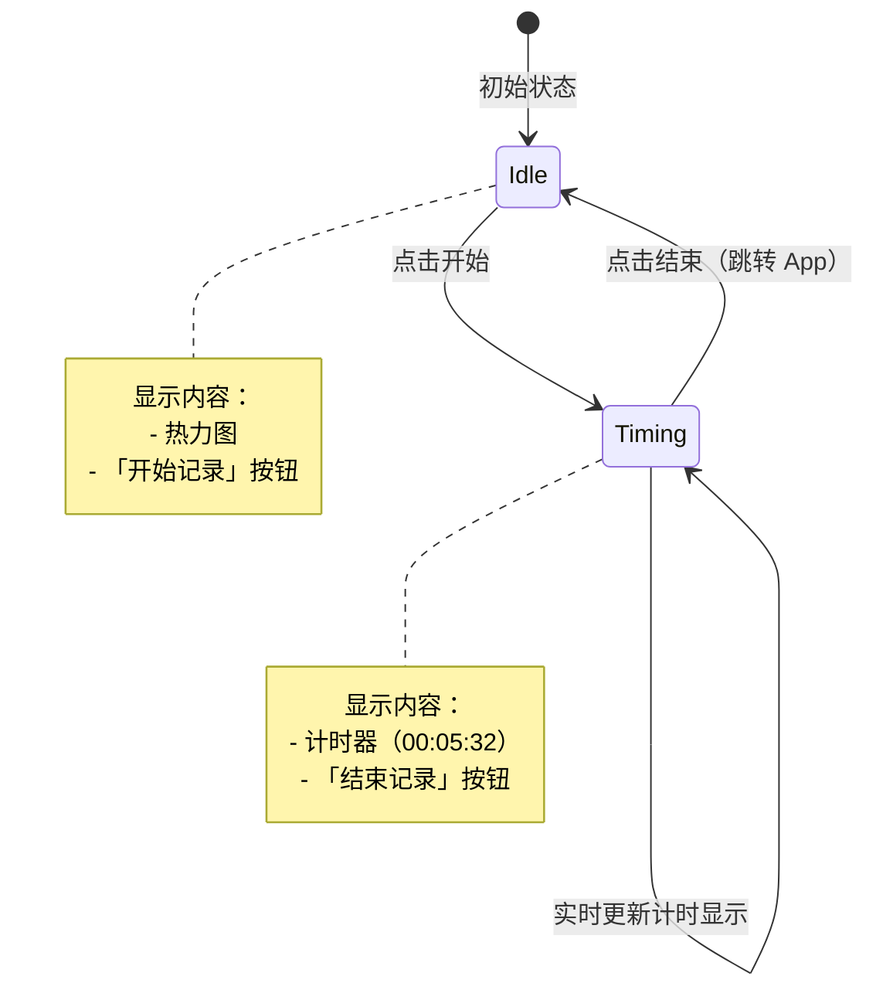
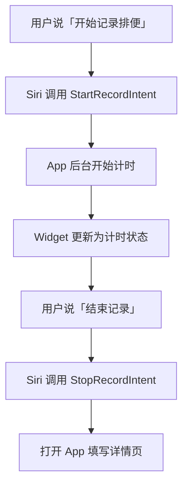
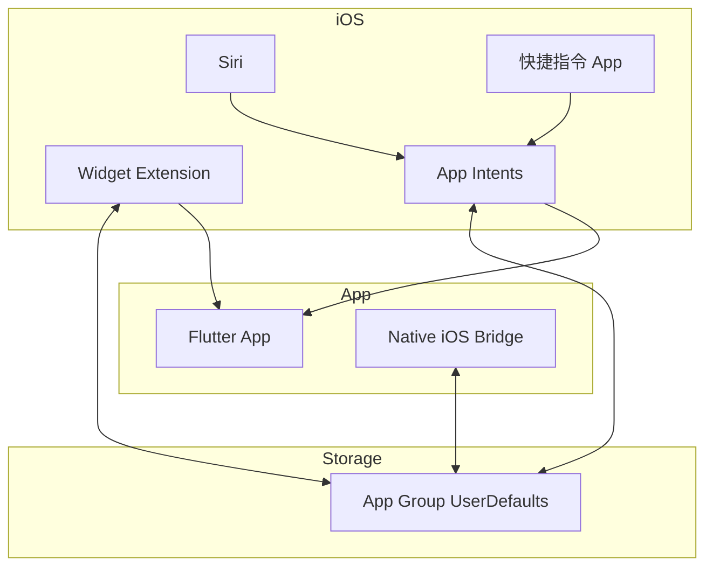

# iOS Widget 与快捷指令

## 功能概述

为实现最快捷的记录方式，需要通过 iOS Widget 和快捷指令提供无需打开 App 即可操作的能力。

### 核心需求

| 需求 | 说明 |
|-----|------|
| 快捷记录 | 无需打开 App 即可开始/结束记录 |
| 实时反馈 | 计时过程中可视化显示进度 |
| 模块独立 | 每个健康模块有独立的 Widget |
| Siri 支持 | 可通过语音指令操作 |

---

## Widget 功能

### 当前状态

| 功能 | 说明 | 状态 |
|-----|------|------|
| 月度热力图 | 显示当月每日记录次数 | ✅ 已实现 |
| 开始记录按钮 | 点击跳转 App 开始记录 | ✅ 已实现 |
| 尺寸 | 仅支持 systemSmall | ✅ 已实现 |

### 目标功能

| 功能 | 说明 | 优先级 |
|-----|------|-------|
| 计时模式 | Widget 上直接开始/结束计时 | P1 |
| 实时计时器 | 计时过程中显示时间（00:05:32） | P1 |
| 结束跳转 | 点击结束后跳转 App 填写详情 | P1 |
| 独立 Widget | 每个模块独立 Widget | P2 |

### Widget 状态流转



### Widget 布局设计

**空闲状态 (Idle)**：
```
┌─────────────────────────┐
│  ┌─┬─┬─┬─┬─┬─┬─┐       │
│  ├─┼─┼─┼─┼─┼─┼─┤       │
│  ├─┼─┼─┼─┼─┼─┼─┤ 热力图 │
│  ├─┼─┼─┼─┼─┼─┼─┤       │
│  └─┴─┴─┴─┴─┴─┴─┘       │
│                         │
│  ┌─────────────────┐    │
│  │   ▶ 开始记录    │    │
│  └─────────────────┘    │
└─────────────────────────┘
```

**计时状态 (Timing)**：
```
┌─────────────────────────┐
│                         │
│       00:05:32          │
│       计时中...          │
│                         │
│  ┌─────────────────┐    │
│  │   ⏹ 结束记录    │    │
│  └─────────────────┘    │
└─────────────────────────┘
```

---

## 快捷指令功能

### 支持的指令

| 指令 | 说明 | Siri 语音示例 |
|-----|------|-------------|
| 开始记录 | 开始某模块的计时 | "嘿 Siri，开始记录排便" |
| 结束记录 | 结束计时并跳转 App 填写 | "嘿 Siri，结束记录" |

### 使用方式

- **纯手动运行**：通过 Siri 语音或快捷指令 App 触发
- 不做自动化触发（如地理围栏、定时等）

### 用户流程



---

## 快捷指令 PRD（开始记录 / 结束记录）

### 目标与范围

- 目标：提供最短路径的“开始/结束计时”入口，支持快捷指令 App 手动触发与 Siri 语音触发。
- 范围：仅限 **开始记录** 与 **结束记录** 两个动作；不做自动化触发（地理围栏/定时）。
- 关键约束：在 SideStore 场景下可用性为 best-effort，允许降级提示与失败反馈。

### 用户故事

- 作为用户，我希望通过快捷指令直接开始某模块的计时，不必打开 App。
- 作为用户，我希望通过快捷指令结束计时并跳转到详情页补充信息。

### 功能需求

**开始记录（StartRecordIntent）**
- 输入参数：`module`（枚举：poop/diet/exercise）
- 行为：
  - 若当前未在计时：开始计时并返回成功结果
  - 若当前已在计时：返回“已在计时中”的结果（不重复开始）
- 输出：
  - 标准文本反馈（成功/失败/已在计时中）
  - 不强制打开 App

**结束记录（StopRecordIntent）**
- 输入参数：可选 `module`（缺省时默认结束当前模块）
- 行为：
  - 若当前在计时：结束计时，保存最小记录（开始时间、结束时间）
  - 若无计时：返回“无进行中的计时”提示
- 输出：
  - 标准文本反馈
  - 可选打开 App：用于补充详情（由 App Intent 的 Open When Run 控制）

### 失败与边界处理

- 未登录：返回明确失败信息，不强制打开 App
- AppGroup 不可用（SideStore）：返回“侧载版本不支持本地共享”或提示打开 App 完成记录
- 已在计时中：开始记录返回“已在计时中”
- 无进行中计时：结束记录返回“无进行中计时”

### 版本与兼容性

- App Intents：iOS 16+
- Siri 语音：best-effort，SideStore 场景可能不稳定

### 验收标准

- 快捷指令 App 可看到“开始记录/结束记录”动作
- 手动运行可返回明确结果
- 未登录/无计时状态均有可读的失败反馈
- SideStore 场景下允许降级提示，应用不崩溃

---

## 技术实现

### 架构图



### 关键技术点

| 技术 | 用途 | 最低版本 |
|-----|------|---------|
| Interactive Widget | Widget 上的按钮交互 | iOS 17+ |
| App Intents | 快捷指令和 Siri 支持 | iOS 16+ |
| App Group | Widget 与 App 共享数据 | iOS 8+ |
| Text(.timer) | Widget 计时器自动更新显示 | iOS 14+ |

### Widget 计时实现方案

由于 iOS Widget 无法主动刷新，采用以下方案：

1. **状态存储**：计时状态存储在 App Group 的 UserDefaults
2. **计时显示**：使用 SwiftUI `Text` 的 `.timer` 样式，系统自动更新
3. **按钮交互**：使用 iOS 17 的 Interactive Widget（AppIntent Button）
4. **数据同步**：通过 App Group 在 Widget 和 App 间共享状态

### App Intents 定义

```swift
// 开始记录
struct StartRecordIntent: AppIntent {
    static var title: LocalizedStringResource = "开始记录"
    static var description = IntentDescription("开始健康记录计时")
    
    @Parameter(title: "模块")
    var module: RecordModule  // 排便/饮食/运动
    
    func perform() async throws -> some IntentResult {
        // 开始计时逻辑
    }
}

// 结束记录
struct StopRecordIntent: AppIntent {
    static var title: LocalizedStringResource = "结束记录"
    static var description = IntentDescription("结束计时并填写详情")
    
    func perform() async throws -> some IntentResult & OpensIntent {
        // 结束计时，打开 App
    }
}
```

### 涉及文件

| 文件 | 职责 |
|-----|------|
| `ios/EasyWidget/EasyWidget.swift` | Widget UI 和数据展示 |
| `ios/EasyWidget/EasyWidgetIntent.swift` | App Intents 定义（新增）|
| `ios/Runner/AppGroup.swift` | App Group 数据共享（新增）|
| `lib/service/widget_bridge.dart` | Flutter 与原生桥接（新增）|

---

## 多模块扩展

### Widget 规划

| 模块 | Widget 名称 | 状态 |
|-----|------------|------|
| 排便记录 | EasyPoopWidget | 待重构 |
| 饮食记录 | EasyDietWidget | 📋 规划中 |
| 运动记录 | EasyExerciseWidget | 📋 规划中 |

每个模块独立 Widget，用户可在桌面自由添加需要的模块。

### 快捷指令规划

| 模块 | 开始指令 | 结束指令 |
|-----|---------|---------|
| 排便记录 | "开始记录排便" | "结束排便记录" |
| 饮食记录 | "开始记录饮食" | "结束饮食记录" |
| 运动记录 | "开始记录运动" | "结束运动记录" |

---

## 优先级

| 优先级 | 内容 | 预估工作量 |
|-------|------|-----------|
| P1 | Widget 计时模式（开始/结束） | 2-3 天 |
| P1 | Widget 实时计时器显示 | 1 天 |
| P1 | 快捷指令支持（开始/结束） | 1-2 天 |
| P2 | 多模块独立 Widget | 1 天 |
| P2 | Siri 语音指令优化 | 0.5 天 |

---

## 限制与注意事项

| 项目 | 说明 |
|-----|------|
| 最低版本 | Interactive Widget 需要 iOS 17+，低版本降级为跳转 App |
| 后台限制 | Widget 无法真正后台运行，计时逻辑在 App 侧 |
| 刷新频率 | Widget 刷新由系统控制，可能有延迟 |
| App Group | 需要配置 App Group 才能共享数据 |
| SideStore | 侧载签名可能剥离 App Groups entitlement，导致 Widget 本地共享不可用 |

---

## SideStore 版本策略（Widget）

### 降级原则

- 不依赖 App Group 共享（若 entitlement 缺失）
- Widget 显示状态提示与引导，不误导用户认为数据已同步

### 推荐交互

- Widget 显示 “侧载版本不支持本地共享” 文案
- 提供按钮跳转 App（如“打开 App 同步”）
- 若检测到 App Group 可用，自动启用完整模式
